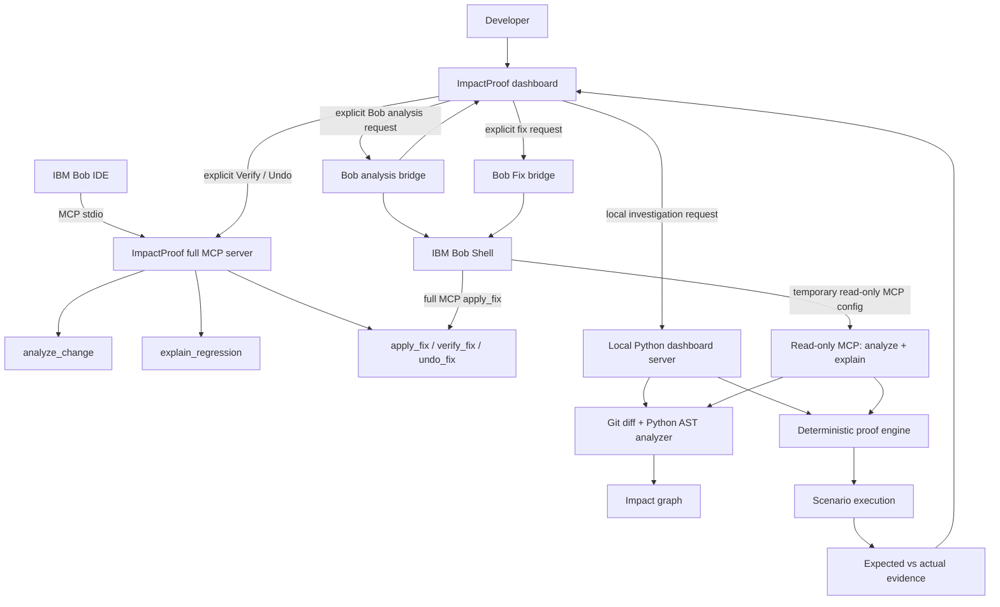

# ImpactProof

## Tagline

**Predict what your code change could break, then prove it by execution.**

## Overview

ImpactProof connects change-impact analysis, deterministic execution, and IBM Bob-assisted remediation in one developer workflow:

**Predict → Prove → Explain → Fix → Verify**

1. Analyze the current Git change.
2. Use Python AST and dependency evidence to predict its potential blast radius.
3. Execute a repository-defined proof scenario.
4. Compare observed values with explicit expectations to identify a regression.
5. Let IBM Bob interpret the evidence and, when requested, propose and apply a targeted fix.
6. Run deterministic verification after the fix.

> **PREDICTION ≠ PROOF**
>
> Static analysis shows what *could* be affected. Scenario execution shows what *did* fail for the inputs that were run. Neither establishes that every possible behavior is correct.

IBM Bob provides agentic orchestration and reasoning around the evidence. The ImpactProof engine—not Bob's prose—produces the dependency analysis and proof verdict.

## Problem

A small code change can travel through imports and symbol relationships and cause a downstream behavioral regression. Developer tools often leave three questions in separate places:

- Static analysis: what **could** be affected?
- Tests: what **actually** fails for the cases that ran?
- An AI assistant: what change might address the failure?

ImpactProof connects those questions so a developer can inspect predicted impact, see execution evidence, and use that evidence during remediation. No technical-debt statistic is included: the repository does not contain a verified statistic and source citation to support one.

## Solution

```text
CHANGE → PREDICT → PROVE → EXPLAIN → FIX → VERIFY
```

| Stage | What ImpactProof does |
| --- | --- |
| **Predict** | Reads Git working-tree changes, parses Python ASTs, resolves in-repository imports and symbol relationships, and builds an impact graph. |
| **Prove** | Runs a named JSON scenario against the target repository, captures function results, extracts configured values, and compares actual values with expected values. |
| **Explain** | Supplies validated analysis and proof evidence to IBM Bob through MCP; Bob reasons from that evidence. |
| **Fix** | Bob can invoke the targeted `apply_fix` MCP tool in the dashboard workflow after the developer requests a fix. |
| **Verify** | ImpactProof reruns the deterministic scenario and reports `PASS`, `REGRESSION`, or `ERROR`. |

## Why ImpactProof is different

> ### PREDICTION ≠ PROOF
>
> **Impact Graph:** “What could be affected?”  
> **Execution Proof:** “What did the selected scenario do?”

The impact graph is derived from Git change and static dependency evidence. It does not mean every displayed node failed. A node is marked as a regression only when an executed proof scenario returns a regression result.

ImpactProof does not stop at an AI-generated explanation: its proof engine executes a deterministic scenario and compares observed values against explicit expectations. The result is limited to the analyzed change, dependencies the analyzer discovers, the scenarios defined, and the inputs and behavior actually executed.

## IBM Bob integration

The repository includes project-level Bob MCP configuration, custom modes, rules, and slash commands. The dashboard can also start a bounded Bob Shell task locally through its server-side bridge. Bob receives evidence from ImpactProof tools; the browser does not receive Bob credentials.

The full MCP server registers these tools:

| Tool | Input | Purpose and effect |
| --- | --- | --- |
| `impactproof_status` | No fields | Reports MCP readiness. Does not modify repository files. |
| `analyze_change` | `repo_path` | Returns changed files/symbols and static impact relationships. Does not modify source files. |
| `explain_regression` | `repo_path`, `scenario` | Executes the selected proof and returns structured expected/actual, mismatch, regression-node, and source evidence. It does not apply a source fix. |
| `apply_fix` | `repo_path`, `file_rel`, `new_source` | Applies a targeted Python source change after path/type checks and syntax validation; creates backup/undo state. This tool modifies a file. |
| `verify_fix` | `repo_path`, `scenario` | Reruns deterministic proof and returns `PASS`, `REGRESSION`, or `ERROR`. It does not apply a source fix. |
| `undo_fix` | `repo_path` | Reverses the latest recorded `apply_fix` change when its state can be validated; fails safely on missing or diverged state. This tool modifies the target file when successful. |

Dashboard Bob analysis uses a temporary MCP workspace with the separate read-only server exposing only `analyze_change` and `explain_regression`. The dashboard's Bob Fix action uses the full MCP server and accepts success only when Bob's named tool event and `apply_fix` result match the expected target. Verification is a separate deterministic action; Undo is optional and explicit. The full MCP server remains available to Bob IDE through `.bob/mcp.json`.

**Responsibility boundary**

- **ImpactProof:** Git diff inspection, Python AST/dependency analysis, graph construction, scenario execution, value comparison, and deterministic verification.
- **IBM Bob:** orchestration and reasoning over returned evidence, user-facing explanation, and a requested remediation call through MCP.

See [Bob integration](docs/bob-integration.md) and [Workflow](docs/workflow.md) for details. Bob is used as a core component of the product workflow and has also been used during the project's development process. This project is not an IBM endorsement.

## Architecture



The interactive dashboard starts idle. Investigation is triggered by the user; graph and proof results appear after the pipeline runs. See [Architecture](docs/architecture.md).

## Demo

The checked-in scenario is `premium_checkout_refund`. The demo's current working tree intentionally contains a premium pricing change and a refund bug:

- A premium $100 purchase is charged $90 after the 10% discount (for purchases meeting the $50 minimum).
- The invoice records the final charged amount.
- `refund.py::refund` returns `original_amount`, so the actual refund is $100 rather than the expected $90.

The current scenario run was verified from this checkout:

| Proof value | Expected | Actual | Result |
| --- | ---: | ---: | --- |
| `final_amount` | $90 | $90 | PASS |
| `invoice_final_amount` | $90 | $90 | PASS |
| `refund_amount` | $90 | $100 | REGRESSION |

The only mismatch is `refund_amount`. The demo currently starts in the regression state; this README does not claim a live Bob fix has been applied to it. See [Demo walkthrough](docs/demo.md).

## Demo results

For this demonstrated repository state, the current run produced **16 graph nodes**, **10 symbol relationships**, **3 proof assertions**, and **1 regression**. These are observations from this specific scenario and checkout, not product-wide performance benchmarks. A different repository, diff, or scenario will produce different results.

## Quick start

### Requirements

- Python 3. The repository does not declare a formal minimum Python version; this checkout was tested with Python 3.13.3.
- Node.js and npm to build/run the MCP server. `package.json` does not declare a supported Node version.
- A Git repository with a commit for change analysis. Bob-assisted actions additionally require a working local IBM Bob installation and authentication.

The Python engine uses the standard library. MCP dependencies are declared in `mcp-server/package.json` and locked in `mcp-server/package-lock.json`.

### Build the MCP server

```bash
cd mcp-server
npm ci
npm run build
```

The build creates `build/index.js`, `build/readonly_index.js`, and copies the Python MCP scripts into `build/`.

The checked-in `.bob/mcp.json` contains a machine-specific executable path. Update its server command/arguments for your local checkout before connecting Bob; do not put credentials in that file.

### Run the deterministic proof

From the ImpactProof repository root, point the command at a Git repository that contains the demo application and its scenario-compatible modules:

```bash
python3 proof/run_proof.py /path/to/target-repository premium_checkout_refund
```

The CLI prints JSON. It exits `0` for `PASS` and `1` for `REGRESSION` or `ERROR`.

### Open the dashboard

```bash
python3 graph/launch_graph.py /path/to/target-repository --scenario premium_checkout_refund
```

The local server serves the dashboard on loopback and the launcher opens the browser. The initial dashboard is idle; click **INVESTIGATE CHANGE** to run analysis and proof. The viewer loads D3 from jsDelivr, so browser access to that CDN is needed to render the graph.

### Use Bob locally

Build MCP first and configure the local Bob project configuration. To use the installed `/impact` launcher, run `sh scripts/install-impactproof-dashboard.sh` from the project root. The dashboard's Bob Shell bridge reads authentication from the user-local file `~/.config/impactproof/bob.env`; create it yourself and restrict access (for example, mode `600`). Its content format is:

```text
BOB_API_KEY="<your-key>"
```

Do not commit this file, paste the key into source/configuration, or share it in chat. The provided launcher installer does not create the secret file. Local launcher and Bob executable paths are currently specific to the hackathon environment; see [Limitations](docs/limitations.md) before using a fresh clone.

## Repository structure

```text
.
├── .bob/
│   ├── commands/                 # Bob slash-command instructions
│   ├── custom_modes.yaml         # ImpactProof and ImpactProof Fix modes
│   ├── mcp.json                  # Project MCP server registration
│   └── rules-impactproof-agent/  # Agent workflow rule
├── bob_sessions/                 # Screenshot naming and session plan; no PNGs checked in
├── docs/                          # Demo and workflow documentation
├── graph/                         # Graph/UI, launcher, Bob runner/analyzer bridges, tests
├── mcp-server/
│   ├── src/                       # Full and read-only MCP entrypoints and Python tools
│   └── build/                     # Compiled MCP entrypoints and copied tool scripts
├── proof/
│   ├── scenarios/                 # JSON behavior scenarios
│   ├── engine.py                  # Scenario execution and comparison
│   └── run_proof.py               # Proof CLI
└── scripts/                       # User-local dashboard launcher and installer
```

Tests live beside the graph, proof, and MCP components; there is no root `tests/` directory.

## Testing

The current test runners are:

```bash
PYTHONDONTWRITEBYTECODE=1 python3 -m unittest discover -s graph
PYTHONDONTWRITEBYTECODE=1 python3 proof/test_proof.py
PYTHONDONTWRITEBYTECODE=1 python3 mcp-server/test_analyze.py
PYTHONDONTWRITEBYTECODE=1 python3 mcp-server/test_regression_tools.py
PYTHONDONTWRITEBYTECODE=1 python3 -m unittest discover -s mcp-server -p 'test_readonly_entrypoint.py'
PYTHONDONTWRITEBYTECODE=1 python3 -m unittest discover -s mcp-server -p 'test_agent_contract.py'
```

Build check:

```bash
cd mcp-server && npm run build
```

This repository does not define a single aggregate test command. Bob is not required for the unit suites above; the live Bob workflow is an integration behavior and should be tested separately in an appropriately configured environment.

## Safety and design

- Static relationships are derived from analyzer output; the graph transformer does not invent additional dependency edges.
- Proof scenarios specify calls, captures, extraction paths, and expected values. Proof status comes from actual execution and comparison.
- `apply_fix` restricts edits to Python source files, blocks test/scenario paths and traversal, validates syntax, and records backup/undo state.
- `undo_fix` targets the recorded latest Bob change and refuses missing, ambiguous, or diverged state rather than restoring an entire repository.
- Bob analysis runs through a temporary MCP configuration exposing only the two read-only analysis tools. Bob Fix uses a separate bridge and full MCP `apply_fix` path.
- The dashboard HTTP server binds to loopback and validates local request host/origin. These checks do not make the local execution environment a general-purpose sandbox.

These are implementation safeguards, not a guarantee that every repository behavior is safe or correct.

## Limitations

- Static parsing and symbol/dependency analysis currently target Python source and depend on relationships the analyzer can resolve.
- Dynamic imports, reflection, runtime-generated relationships, and unmodeled languages are outside the analyzer's demonstrated scope.
- Proof coverage is scenario- and input-specific; passing a scenario is not a universal correctness guarantee.
- Analysis requires Git repository metadata and a committed baseline; the analyzer uses tracked Git changes and does not treat untracked files as changed source.
- Bob Shell, credentials, Bob configuration, and local executable paths must be available and correctly configured. The checked-in local paths are not portable as-is.
- Bob runner and dashboard bridge restrict analysis to the configured product/demo workspaces; a different target requires an intentional local configuration change.
- The dashboard uses an external D3 CDN resource.

See [Limitations](docs/limitations.md) for the detailed boundaries.

## Built with IBM Bob

IBM Bob is a core part of the workflow: Bob connects to the ImpactProof MCP tools, orchestrates evidence gathering, reasons about root cause, and can request a targeted fix. ImpactProof performs deterministic dependency analysis and execution proof; Bob does not replace those computations. The team has also used IBM Bob during the project's development process. This project is an independent hackathon submission and does not imply IBM endorsement.

## References

- [ImpactProof workflow contract](docs/impactproof-agent-workflow.md)
- [Proof scenario format](docs/proof-engine.md)
- [IBM Bob project configuration in this repository](docs/bob-integration.md)
