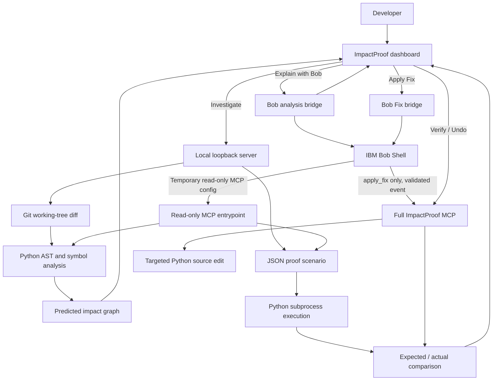

# ImpactProof architecture

ImpactProof separates deterministic engineering evidence from agent reasoning. The analyzer, graph transformer, and proof engine produce evidence; IBM Bob orchestrates MCP calls and reasons over the results.

## Components

| Component | Responsibility |
| --- | --- |
| `mcp-server/src/analyze.py` | Requires a Git repository, reads changed tracked files, parses Python ASTs, resolves in-repository imports and symbol relationships, and returns changed/direct/indirect impact evidence. |
| `graph/graph.py` | Converts analyzer evidence into graph nodes/edges and marks regression nodes only when deterministic proof evidence supports them. It does not infer additional edges. |
| `proof/engine.py` | Loads JSON scenario definitions, executes their calls in a Python subprocess, captures/extracts values, and compares actual values with expected values. |
| `mcp-server/src/index.ts` | Full MCP STDIO server; registers status, analysis, explanation, apply, verify, and undo tools. |
| `mcp-server/src/readonly_index.ts` | Separate MCP STDIO entrypoint registering only `analyze_change` and `explain_regression`. |
| `graph/launch_graph.py` | Runs the local investigation pipeline, renders the viewer, starts its loopback HTTP server, and opens the browser. It also routes dashboard Bob/verify/undo actions to existing components. |
| `graph/bob_runner.py` | Starts a bounded local IBM Bob Shell task using a fixed executable/runtime and validates allowed workspaces, modes, and resource limits. |
| `graph/bob_analyzer.py` | Builds the analysis-only task and validates Bob's returned evidence before exposing a dashboard result. |
| `graph/bob_bridge.py` | Connects the dashboard to Bob analysis and the separately requested Bob `apply_fix` task. |
| `.bob/` | Project-level MCP registration, custom modes, rules, and slash-command instructions for Bob IDE. |

## Data and control flow

There are two Bob integration paths. In Bob IDE, project configuration registers the full MCP server over STDIO. In the dashboard, Bob Shell runs locally from the server side: analysis uses an isolated temporary MCP configuration with only two read-only tools; a requested fix uses the full server through a separate bridge. The browser does not receive the Bob API key.

## Deterministic analysis and graph

The analyzer compares the target repository's tracked working-tree changes against Git and parses Python files. It returns static relationships and direct/indirect affected files. The graph transform uses those returned relationships as its source of truth. The impact graph is a prediction of possible blast radius, not proof that a node failed at runtime.

## Proof

Scenario JSON names Python modules/functions, arguments, captures, extraction rules, and expected values. The engine executes the specified calls and compares captured values. A mismatch produces `REGRESSION`; execution or extraction errors produce `ERROR`. See [Proof engine](proof-engine.md).

## Dashboard and remediation

The initial dashboard is idle. The user explicitly starts investigation. If proof finds a regression, the dashboard can request Bob analysis, then a fix. Applying a fix does not imply verification; a separate verification action reruns the deterministic scenario. Undo is optional and explicit. See [Workflow](workflow.md).

